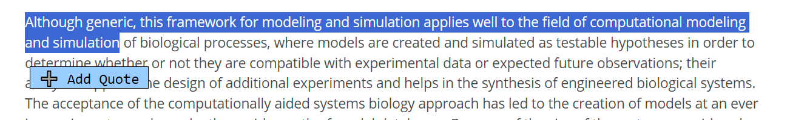
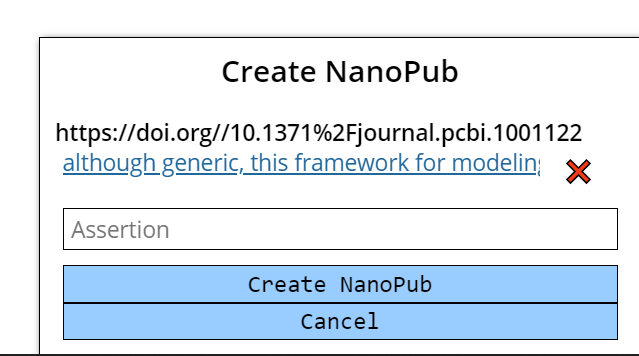
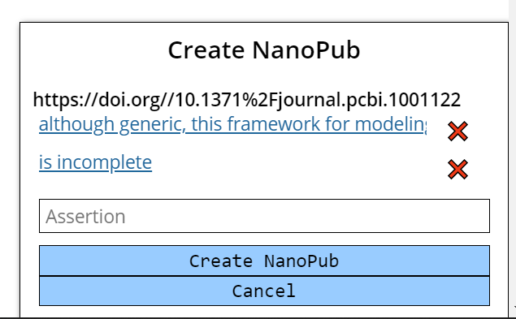
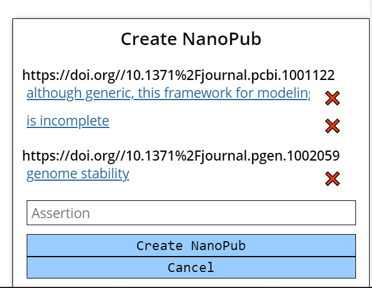

# Literature Biocuration Practices and Guidelines 

[Elixir - BioHackaton 2023 - Project 26](https://github.com/elixir-europe/biohackathon-projects-2023/blob/main/26/README.md)

## Preprint

[BioHackEU23 report: Project 26: Literature Biocuration Practices and Guidelines](preprint.md)

## Browser extension

### Installation

#### Elixir 2023 BioHackaton version

⚠️ Authentification was not implemented during the hackathon, so the installation procedure is cumbersome.

Go to the [next section](#user-content-once-orcid-login-is-properly-supported) if you just want to give try: you won't be able to publish the NanoPub, but all the steps before work.

Installation steps:
* Install [Tampermonkey](https://www.tampermonkey.net/) browser extension.
* Open TamperMonkey window
* Choose "Create a new script..."
* Copy and paste the content of [annotations_to_nanopub.js](https://raw.githubusercontent.com/MetabolicAtlas/biohackathon23/main/browser_extension/annotations_to_nanopub.js).

Then to create a NanoPub you have to be logged in, which was not implemented during the hackathon:

* Login on https://api.collaboratory.semanticscience.org/docs
* Get the authentification header from https://api.collaboratory.semanticscience.org with `OpenIdConnect (OAuth2, implicit)`
* Try out the `/generate-keys` (only once).
* Make a call to `/current-user`
* Copy the `Authorization` header value to `AUTH_TOKEN` variable in the script.

The token is going to expire in about 30 minutes, so you have to repeat the above procedure except the call to `/generate-keys`.

#### Once ORCID login is properly supported

* Install [Tampermonkey](https://www.tampermonkey.net/) browser extension.
* Follow this link <https://raw.githubusercontent.com/MetabolicAtlas/biohackathon23/main/browser_extension/annotations_to_nanopub.js>
* Tampermonkey will show a popup to install the script
* Click on the "Install" button

#### Dedicated browser extension

Of course, in the future, it makes sense to create a standalone browser extension so all the steps above will much simpler.

### Usage

On:
* https://europepmc.org/article/
* https://www.ncbi.nlm.nih.gov/pubmed/
* https://www.nature.com/articles/

When you select some text, a button appears:

When clicked, a cart appears at the bottom right of the screen:

You can make multiple selection:

You can add quotes from multiple documents (the extension keeps your cart across the pages):

Enter the assertion, and when ready, you can click on "Create NanoPub", the browser is going to open a new tab automatically.

Example of NanoPublication: <https://np.petapico.org/RARpP8Q4RqW3uLUb2pT2C-zlwSofhvwfsXveK5-ccLq4k>

The schema follows the [Web Annotation Data Model](https://www.w3.org/TR/annotation-model/).
