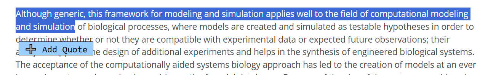
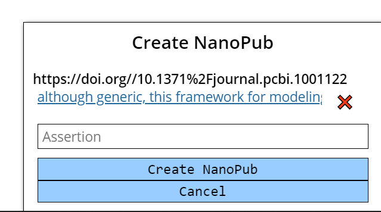
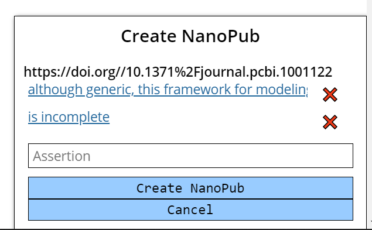
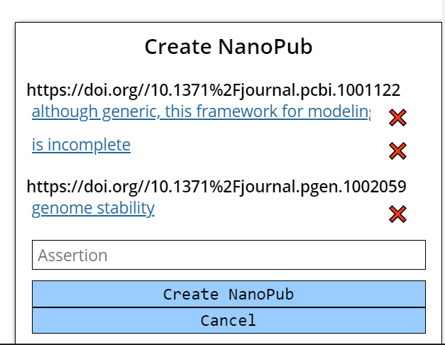

Add an eBioDiv link to the GBIF occurrence page using a Firefox extension and a Javascript:

## Installation
* Install Tampermonkey:
    * For [Firefox](https://addons.mozilla.org/en-US/firefox/addon/tampermonkey/)
    * For [Chrome](https://chrome.google.com/webstore/detail/tampermonkey/dhdgffkkebhmkfjojejmpbldmpobfkfo)
    * Other browser see <https://www.tampermonkey.net/>
* Follow this link <https://raw.githubusercontent.com/MetabolicAtlas/biohackathon23/main/browser_extension/annotations_to_nanopub.js>
* Tampermonkey will show a popup to install the script
* Click on the "Install" button

## Usage

On:
* https://europepmc.org/article/
* https://www.ncbi.nlm.nih.gov/pubmed/
* https://www.nature.com/articles/

When you select some text, a button appears:

When clicked, a cart appears at the bottom right of the screen:

You can make multiple selection:

You can add quotes from multiple documents (the extension keeps your cart across the pages):

Enter the assertion, and when ready, you can click on "Create NanoPub", the browser is going to open a new tab automatically.

<https://np.petapico.org/RARpP8Q4RqW3uLUb2pT2C-zlwSofhvwfsXveK5-ccLq4k>
